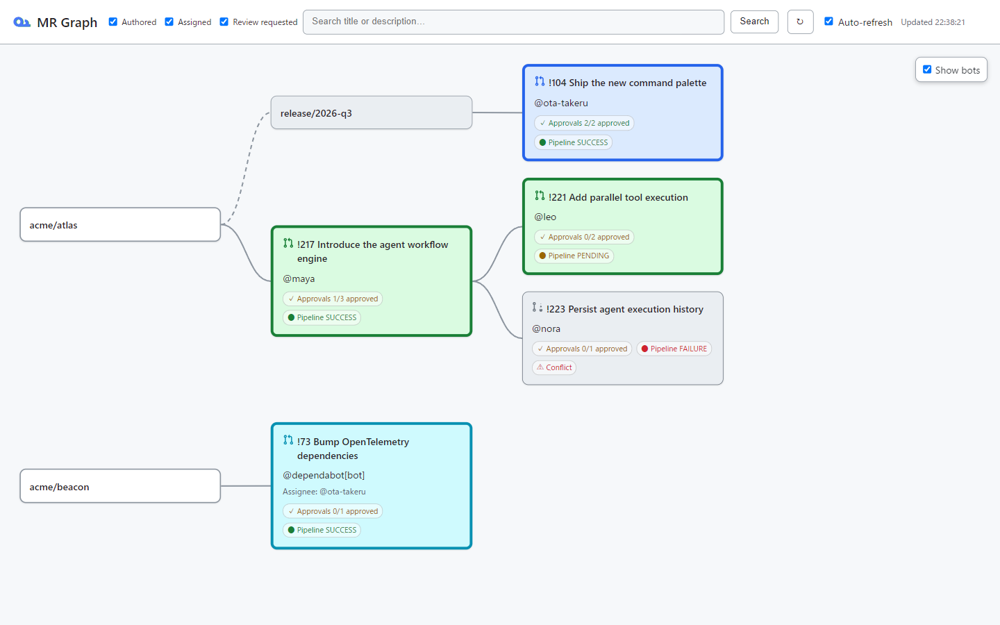

# glab-mr-graph

`glab-mr-graph` turns GitLab Merge Requests that need your attention into one
local visual workspace. It collects open MRs you authored, were assigned, or
were asked to review, then follows exact source/target project and branch
relationships to show stacked work across projects.



The project is a GitLab-oriented fork of
[`orangain/gh-pr-graph`](https://github.com/orangain/gh-pr-graph). The graph
layout and local server retain the upstream implementation where that keeps
the behavior stable; the provider, API mapping, UI wording, and release
artifacts are GitLab-specific.

## Requirements

- [GitLab CLI (`glab`)](https://gitlab.com/gitlab-org/cli), authenticated with
  `glab auth login`
- Go 1.23 or newer when building from source

The authenticated `glab` configuration supplies the token for GitLab.com or a
self-managed GitLab instance. Tokens and API responses are never passed to
the browser or written to disk.

## Install and run

Download a release binary named `glab-mr-graph`, or build it locally:

```sh
make build
./glab-mr-graph
```

The server listens only on `127.0.0.1` and opens the graph in your browser.
Press Ctrl-C to stop it.

```text
--no-open          print the URL without opening a browser
--port 8080        override the preferred local port (8787)
--hostname HOST    use a GitLab.com or self-managed GitLab hostname
```

For example:

```sh
./glab-mr-graph --hostname gitlab.example.com --no-open
```

The Authored, Assigned, and Review requested filters are OR conditions. The
search field adds a fourth OR condition and searches MR titles and
descriptions. Clear all three relationship filters to use only the text
search.

MR node backgrounds show why an MR is in the workspace: blue means authored,
cyan means assigned, green means review requested, and gray means related
stack context. Draft/ready state, approval counts, pipeline status, and merge
conflicts are shown independently. The UI is read-only in this first GitLab
version; Included MR history, pending-review comments, and re-review markers
are intentionally disabled.

## Demo mode

Use the built-in fixture data to work on the UI without querying GitLab:

```sh
GLAB_MR_GRAPH_DEMO=1 ./glab-mr-graph
```

Demo mode is enabled only through `GLAB_MR_GRAPH_DEMO`; it is not a CLI option.

## Development

```sh
make test
make build
```

The provider lives in `internal/gitlab`. It invokes `glab api --paginate`,
deduplicates global MR IDs across the three relationship searches, hydrates
MR details and approvals, and keeps a process-local project cache. The
command runner is injectable so API fixtures can be tested without a token.

Stack discovery is breadth-first and bounded to 500 MRs and 20 levels. A
relationship is accepted only when the project ID and branch name both match;
same-named branches in forks cannot create an edge.

For design decisions and data-flow limits, see [DESIGN.md](DESIGN.md). For a
GitHub-to-GitLab comparison and current implementation boundaries, see
[docs/github-gitlab-differences.md](docs/github-gitlab-differences.md).

## Tracing

Set `GLAB_MR_GRAPH_TRACE_OTEL=1` to export optional OpenTelemetry traces to
`http://localhost:4318/v1/traces`. Set the variable to an explicit collector
URL to use a different endpoint. Tracing is best effort and does not include
API response bodies or tokens.

## Releases

GitHub Actions runs JavaScript checks, tests, vet, and cross-platform builds.
User-facing changes are recorded under `Unreleased` in
[CHANGELOG.md](CHANGELOG.md). Release preparation follows the upstream
workflow and produces artifacts based on the `glab-mr-graph` binary name.

## License and attribution

This project is MIT licensed. See [LICENSE](LICENSE). It is derived from
[`orangain/gh-pr-graph`](https://github.com/orangain/gh-pr-graph), also MIT
licensed; the upstream copyright and license notice are retained.
